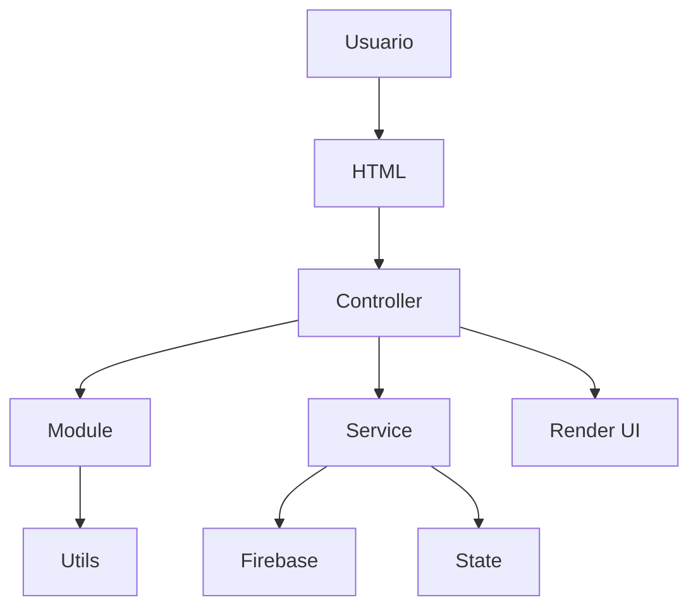

# RUTEO LOGÍSTICA

# Engineering Handbook

## Documento 04

# ARQUITECTURA GENERAL DEL SISTEMA

**Versión:** 1.0

**Estado:** Activo

**Proyecto:** Ruteo Logística

**Documentos relacionados**

- Documento 01 – Prompt Maestro
- Documento 02 – Filosofía del Proyecto
- Documento 03 – Objetivos del Proyecto

---

# 1. Propósito

Este documento define la arquitectura oficial del proyecto **Ruteo Logística**.

Su objetivo es establecer una estructura clara, modular y escalable que facilite el desarrollo, el mantenimiento y la evolución de la aplicación.

Toda nueva funcionalidad deberá respetar la arquitectura definida en este documento.

---

# 2. Principios Arquitectónicos

La arquitectura del sistema se basa en los siguientes principios:

- Separación de responsabilidades.
- Modularidad.
- Bajo acoplamiento.
- Alta cohesión.
- Reutilización.
- Escalabilidad.
- Mantenibilidad.
- Documentación continua.

La arquitectura debe permitir que el sistema crezca sin necesidad de reorganizar completamente el proyecto.

---

# 3. Estructura General del Proyecto

La estructura actual del proyecto es la siguiente:

```text
Ruteo_logistica/

│
├── assets/
│
├── css/
│
├── js/
│   ├── controllers/
│   ├── modules/
│   ├── services/
│   ├── state/
│   ├── utils/
│   └── app.js
│
├── pages/
│
├── scss/
│   ├── base/
│   ├── components/
│   ├── layout/
│   ├── pages/
│   └── main.scss
│
└── index.html
```

Esta estructura deberá mantenerse como estándar del proyecto.

---

# 4. Filosofía de la Arquitectura

La arquitectura está organizada por responsabilidades.

Cada carpeta cumple una única función dentro del sistema.

Esto permite:

- localizar fácilmente el código;
- reducir dependencias;
- facilitar el mantenimiento;
- mejorar la escalabilidad;
- simplificar futuras incorporaciones.

---

# 5. Arquitectura por Capas

El proyecto sigue una arquitectura en capas.

```text
Usuario

↓

HTML

↓

Controllers

↓

Modules

↓

Services

↓

Firebase / Persistencia

↓

Respuesta

↓

Actualización del DOM
```

Cada capa conoce únicamente la capa inmediatamente inferior.

---

# 6. Responsabilidad de cada carpeta

## assets/

Contiene todos los recursos estáticos del proyecto.

Ejemplos:

- iconos;
- imágenes;
- logotipos;
- recursos gráficos.

No debe contener lógica de negocio.

---

## css/

Contiene el CSS compilado.

No debe editarse manualmente.

Toda modificación deberá realizarse sobre SCSS.

---

## scss/

Es la fuente oficial de estilos.

Está dividido por responsabilidades.

### base/

Configuración global.

Ejemplos:

- variables;
- tipografía;
- reset;
- colores;
- utilidades.

---

### layout/

Define la estructura principal.

Ejemplos:

- navbar;
- sidebar;
- footer;
- grid;
- contenedores.

---

### components/

Componentes reutilizables.

Ejemplos:

- botones;
- cards;
- tablas;
- formularios;
- modales;
- loaders.

---

### pages/

Estilos específicos de cada pantalla.

Nunca deberá duplicarse código que pueda pertenecer a components.

---

## pages/

Contiene todas las vistas HTML.

Cada pantalla representa una funcionalidad del sistema.

Ejemplos:

- Login
- Dashboard
- Clientes
- Shipping
- Transporte
- Administración

Las vistas solo deben contener estructura y contenido.

Nunca lógica de negocio.

---

## js/

Es el núcleo de la aplicación.

Toda la lógica vive dentro de esta carpeta.

---

# 7. Arquitectura JavaScript

La organización JavaScript sigue una arquitectura modular.

```text
Controllers

↓

Modules

↓

Services

↓

State

↓

Utils
```

---

## Controllers

Responsabilidad:

Coordinar la interacción entre la interfaz y el sistema.

Deben:

- escuchar eventos;
- validar entradas;
- llamar a Services;
- actualizar la interfaz.

No deben:

- acceder directamente a Firebase;
- contener lógica compleja;
- duplicar código.

---

## Modules

Responsabilidad:

Implementar funcionalidades reutilizables.

Ejemplos:

- filtros;
- tablas;
- exportaciones;
- mapas;
- gráficos.

Un módulo debe poder reutilizarse desde distintos Controllers.

---

## Services

Responsabilidad:

Gestionar toda interacción con Firebase y otras fuentes de datos.

Deben:

- centralizar consultas;
- encapsular reglas de acceso;
- manejar errores.

Nunca deberán modificar directamente la interfaz.

---

## State

Responsabilidad:

Mantener el estado global de la aplicación.

Debe centralizar información compartida entre módulos.

---

## Utils

Responsabilidad:

Funciones auxiliares reutilizables.

Ejemplos:

- formateo;
- validaciones;
- fechas;
- utilidades matemáticas;
- helpers.

Nunca deberán depender de Controllers.

---

# 8. Flujo de Datos

El flujo oficial del sistema será:

```text
Usuario

↓

Evento

↓

Controller

↓

Service

↓

Firebase

↓

Service

↓

Controller

↓

Render UI
```

Todo flujo nuevo deberá respetar esta secuencia.

---

# 9. Flujo de Estilos

Los estilos deberán seguir el siguiente recorrido:

```text
SCSS

↓

Compilación

↓

CSS

↓

HTML
```

Nunca deberá modificarse directamente el CSS compilado.

---

# 10. Comunicación entre módulos

Las dependencias deberán mantenerse al mínimo.

Relaciones permitidas:

- Controllers → Services
- Controllers → Modules
- Controllers → State
- Modules → Utils
- Services → Utils

Relaciones prohibidas:

- HTML → Firebase
- HTML → Services
- CSS → JavaScript
- Controllers → Controllers
- Services → DOM

---

# 11. Principios de Escalabilidad

Toda nueva funcionalidad deberá:

- tener su propio módulo cuando corresponda;
- reutilizar componentes existentes;
- evitar duplicación;
- respetar la estructura de carpetas;
- documentarse.

---

# 12. Arquitectura Responsive

El diseño seguirá una estrategia Mobile First.

Los componentes deberán adaptarse progresivamente.

Se utilizarán los siguientes puntos de corte:

- 320 px
- 375 px
- 425 px
- 768 px
- 1024 px
- 1366 px
- 1920 px

---

# 13. Seguridad Arquitectónica

Las vistas nunca accederán directamente a Firebase.

Toda persistencia deberá realizarse mediante Services.

Las validaciones deberán existir antes de cualquier operación crítica.

---

# 14. Fortalezas actuales del proyecto

Tras la revisión inicial del código, se identifican las siguientes fortalezas:

- Separación inicial por responsabilidades.
- Organización modular de JavaScript.
- Uso de SCSS por capas.
- Separación entre páginas y estilos.
- Base adecuada para evolucionar hacia una arquitectura escalable.

Estas fortalezas deberán conservarse durante toda la evolución del proyecto.

---

# 15. Oportunidades de mejora

Durante las futuras auditorías se evaluarán los siguientes aspectos:

- reducción del acoplamiento entre módulos;
- reutilización de componentes;
- eliminación de código duplicado;
- mejora de la organización de Services;
- optimización del manejo del estado;
- fortalecimiento del sistema responsive;
- incremento de la cobertura documental.

Cada mejora aprobada deberá registrarse en la Bitácora Técnica y en la Deuda Técnica cuando corresponda.

---

# 16. Diagrama General de Arquitectura



---

# 17. Normas Arquitectónicas

Toda nueva funcionalidad deberá cumplir:

- respetar esta arquitectura;
- mantener la separación de responsabilidades;
- minimizar el acoplamiento;
- favorecer la reutilización;
- mantener consistencia con el resto del proyecto.

Las excepciones deberán documentarse y justificarse técnicamente.

---

# 18. Evolución de la Arquitectura

La arquitectura podrá evolucionar cuando exista una justificación técnica clara.

Toda modificación estructural deberá:

1. actualizar este documento;
2. registrarse en la Bitácora Técnica;
3. reflejarse en el Historial de Versiones;
4. actualizar el Roadmap si afecta futuras funcionalidades.

---

## Próximos documentos relacionados

- Documento 05 – Flujo de Trabajo
- Documento 06 – Convenciones del Proyecto
- Documento 07 – Arquitectura JavaScript
- Documento 08 – Arquitectura SCSS

---

**Fin del Documento 04 – Arquitectura General**

**Engineering Handbook – Ruteo Logística v1.0**
