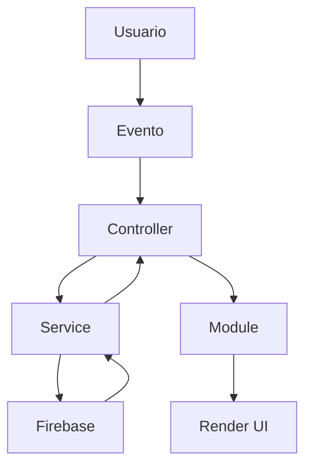

# RUTEO LOGÍSTICA

# Engineering Handbook

## Documento 06

# ARQUITECTURA JAVASCRIPT

**Versión:** 1.0

**Estado:** Activo

**Proyecto:** Ruteo Logística

**Documentos relacionados**

- Documento 01 – Prompt Maestro
- Documento 02 – Filosofía del Proyecto
- Documento 03 – Objetivos del Proyecto
- Documento 04 – Arquitectura General
- Documento 05 – Flujo de Trabajo

---

# 1. Propósito

Este documento define la arquitectura JavaScript oficial de Ruteo Logística.

Su finalidad es garantizar que toda la lógica de la aplicación se desarrolle siguiendo una estructura modular, mantenible y escalable.

Toda nueva funcionalidad deberá respetar las reglas aquí establecidas.

---

# 2. Objetivos de la Arquitectura JavaScript

La arquitectura busca:

- Separar responsabilidades.
- Reducir el acoplamiento.
- Favorecer la reutilización.
- Facilitar el mantenimiento.
- Simplificar las pruebas.
- Permitir el crecimiento del proyecto.

Cada archivo deberá cumplir una única responsabilidad.

---

# 3. Tecnologías Utilizadas

La capa JavaScript utiliza:

- JavaScript ES6+
- ES Modules
- Firebase SDK
- DOM API
- LocalStorage (cuando corresponda)

No se utilizarán librerías externas sin una justificación técnica documentada.

---

# 4. Estructura Oficial

La carpeta `js/` constituye el núcleo funcional de la aplicación.

```text
js/
│
├── controllers/
├── services/
├── modules/
├── state/
├── utils/
└── app.js
```

Cada directorio tiene una responsabilidad claramente definida.

---

# 5. Filosofía de Diseño

Toda lógica deberá organizarse por capas.

Ninguna capa podrá asumir responsabilidades de otra.

El flujo de ejecución siempre deberá mantenerse claro y predecible.

---

# 6. Flujo General de Ejecución



Los Controllers actúan como coordinadores.

Los Services gestionan los datos.

Los Modules encapsulan funcionalidades reutilizables.

---

# 7. Controllers

## Responsabilidad

Los Controllers representan la capa de coordinación.

Son el punto de entrada de todas las acciones del usuario.

Deben:

- escuchar eventos;
- validar entradas;
- invocar Services;
- solicitar renderizados;
- coordinar Modules.

No deben:

- acceder directamente a Firebase;
- contener consultas;
- manipular datos persistentes;
- incluir lógica excesiva.

---

# 8. Services

Los Services representan la capa de acceso a datos.

Su función es abstraer completamente Firebase y cualquier otra fuente de información.

Responsabilidades:

- CRUD;
- autenticación;
- almacenamiento;
- consultas;
- manejo de errores.

Los Services nunca deben modificar el DOM.

---

# 9. Modules

Los Modules contienen funcionalidades reutilizables.

Ejemplos:

- tablas;
- filtros;
- paginación;
- exportaciones;
- gráficos;
- cálculos.

Un Module debe poder utilizarse desde distintos Controllers.

---

# 10. State

La carpeta `state/` centraliza la información compartida.

Debe utilizarse para:

- usuario autenticado;
- configuración global;
- filtros activos;
- información temporal.

Evita duplicar estado entre Controllers.

---

# 11. Utils

Los Utils contienen funciones auxiliares.

Ejemplos:

- validaciones;
- fechas;
- formateos;
- números;
- cadenas;
- helpers.

Los Utils deben ser completamente independientes.

Nunca deben depender del DOM.

---

# 12. app.js

`app.js` constituye el punto de inicio de la aplicación.

Responsabilidades:

- inicializar módulos;
- registrar eventos globales;
- cargar configuración;
- iniciar la aplicación.

No debe contener lógica de negocio.

---

# 13. Flujo de Datos

El flujo oficial será:

```text
Usuario

↓

Controller

↓

Service

↓

Firebase

↓

Service

↓

Controller

↓

Module

↓

Render
```

No se permiten atajos entre capas.

---

# 14. Flujo de Eventos

Todo evento seguirá este recorrido:

1. Usuario interactúa.
2. El Controller recibe el evento.
3. Se validan los datos.
4. Se llama al Service.
5. Se procesa la respuesta.
6. Se actualiza el State.
7. Se renderiza la interfaz.

---

# 15. Flujo de Renderizado

Los cambios visuales deberán producirse únicamente después de obtener una respuesta válida de la lógica de negocio.

Nunca se renderizarán datos inconsistentes.

---

# 16. Flujo de Firebase

Toda comunicación con Firebase seguirá este patrón:

```text
Controller

↓

Service

↓

Firebase

↓

Service

↓

Controller
```

Las vistas desconocen completamente Firebase.

---

# 17. Convenciones de Imports

Orden recomendado:

1. Librerías externas.
2. Services.
3. Modules.
4. Utils.
5. State.

Ejemplo:

```javascript
import { obtenerClientes } from "../services/clientesService.js";
import { renderTabla } from "../modules/tabla.js";
import { formatearFecha } from "../utils/date.js";
```

---

# 18. Convenciones de Exports

Se favorecerán los **named exports**.

Ejemplo:

```javascript
export function obtenerClientes() {}

export function guardarCliente() {}
```

Evitar `export default` salvo casos justificados.

---

# 19. Manejo de Errores

Todo acceso a datos deberá utilizar `try...catch`.

Los errores deberán:

- registrarse;
- mostrarse de forma amigable al usuario;
- documentarse si revelan deuda técnica.

Nunca ocultar errores silenciosamente.

---

# 20. Organización de Funciones

Orden recomendado dentro de cada archivo:

1. Imports.
2. Constantes.
3. Variables privadas.
4. Inicialización.
5. Funciones públicas.
6. Funciones privadas.
7. Exports.

Mantener un orden consistente facilita la lectura.

---

# 21. Dependencias Permitidas

Relaciones permitidas:

- Controller → Service
- Controller → Module
- Controller → State
- Module → Utils
- Service → Utils

Relaciones prohibidas:

- Controller → Controller
- Service → DOM
- View → Firebase
- Module → Firebase
- Utils → DOM

---

# 22. Buenas Prácticas

Todo código deberá:

- utilizar nombres descriptivos;
- mantener funciones pequeñas;
- evitar efectos secundarios;
- documentar lógica compleja;
- reutilizar componentes;
- minimizar dependencias.

---

# 23. Errores Comunes a Evitar

- Funciones de más de 50 líneas.
- Duplicación de lógica.
- Variables globales.
- Consultas Firebase en Controllers.
- Manipulación del DOM desde Services.
- Acoplamiento entre Controllers.

---

# 24. Checklist de Revisión

Antes de integrar un archivo JavaScript verificar:

- Cumple responsabilidad única.
- Respeta la arquitectura.
- No duplica lógica.
- Utiliza imports correctamente.
- Maneja errores.
- Está documentado.
- Es reutilizable.
- No genera advertencias en consola.

---

# 25. Recomendaciones para la Evolución

A medida que el proyecto crezca se recomienda:

- incorporar pruebas unitarias;
- definir interfaces para Services;
- centralizar constantes;
- crear una capa de configuración;
- implementar un sistema de eventos desacoplado.

Estas mejoras deberán evaluarse en futuras versiones.

---

# 26. Conclusión

La arquitectura JavaScript es uno de los pilares de Ruteo Logística.

Su correcta aplicación garantiza un código limpio, modular y preparado para crecer.

Toda nueva funcionalidad deberá respetar las reglas establecidas en este documento.

---

## Próximos documentos relacionados

- Documento 07 – Controllers
- Documento 08 – Services
- Documento 09 – Módulos
- Documento 10 – State
- Documento 11 – Utils

---

**Fin del Documento 06 – Arquitectura JavaScript**

**Engineering Handbook – Ruteo Logística v1.0**
